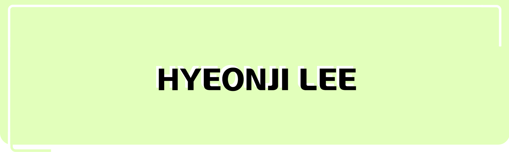
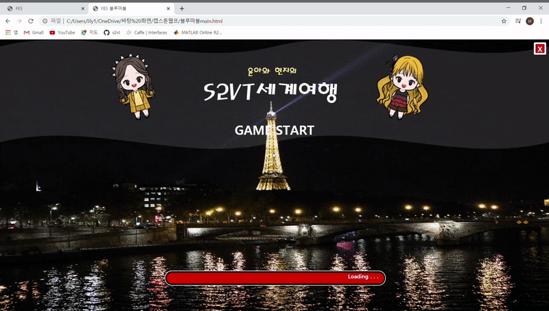
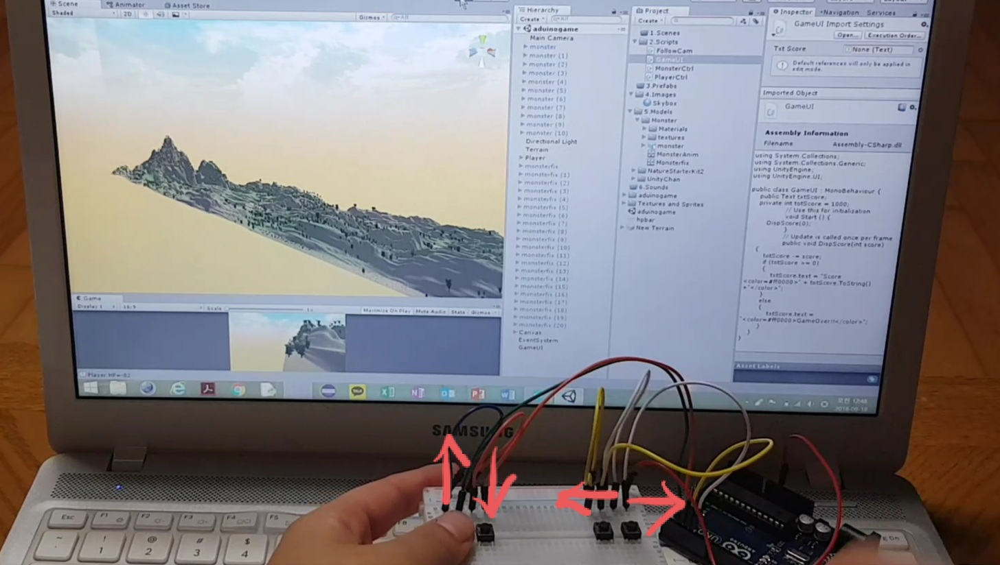

  

🌈 <b><ins>Intruduction</ins></b> 🌈

Hello!
 
I'm HYEONJI LEE🙋‍
 
I want to be a Front-end Developer.

 

 
 

🌈 <b><ins>TECH STACK</ins></b> 🌈

Techs that I've used at least once

</a>
</a>
</a>
 
</a>
</a>
</a>
</a>
</a>
 
</a>
</a>
</a>
</a>

 

***

 

🌈 <b><ins>PROJECTS</ins></b> 🌈

[ Capstone Design - Video Captioning ]   
</a> &nbsp&nbsp&nbsp&nbsp
<a href src="https://github.com/Hyeon1445/Capstone_Design_2020">https://github.com/Hyeon1445/Capstone_Design_2020</a>
  </a> &nbsp&nbsp
<a href src="https://www.youtube.com/watch?v=URbBxMFpzMo">https://www.youtube.com/watch?v=URbBxMFpzMo</a>
  (발표 영상은 소리 꼭 켜고 보세요!)
   
 </a>
 </a>
 </a>
</a>
</a>
  
 </a>
</a>
</a>
 
</a>
</a>
</a>
   

  

***

  [ Unity + Arduino : 3D GAME ]   
</a>
</a>
 

* 방향키는 아두이노 사용
* 정지해있거나 쫓아오는 몬스터를 피해 목적지에 도착하기
* 처음 시작 점수 1000점
* Damage 1번당 -100점
* 0점 미만은 Game Over

  

